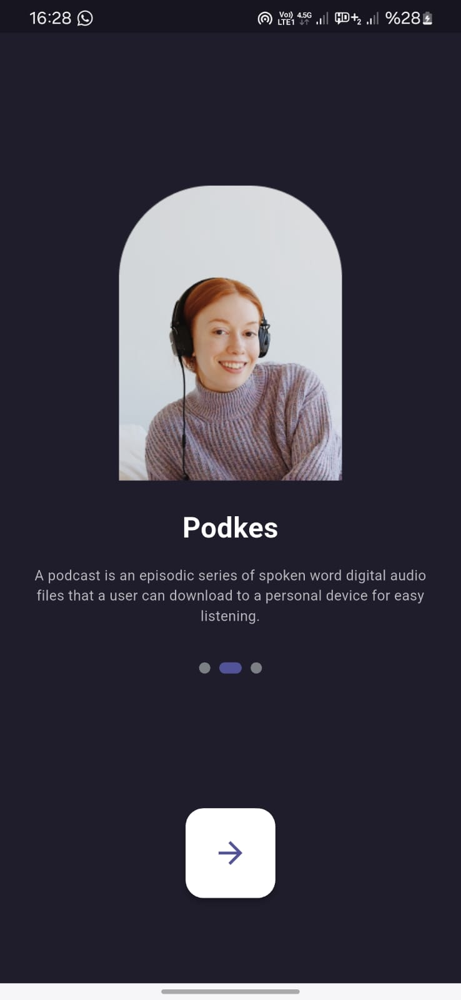
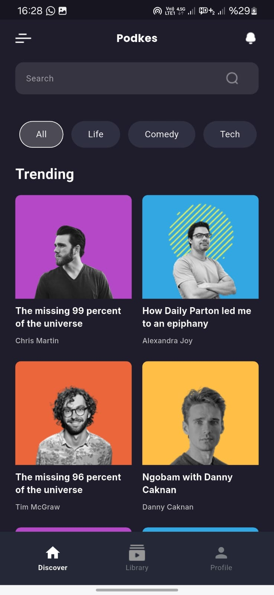
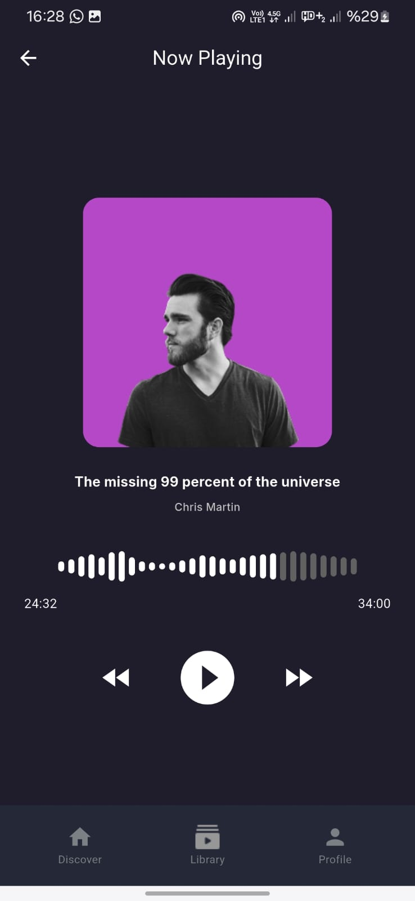
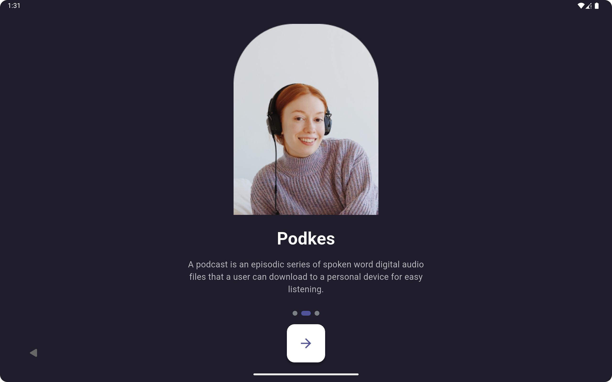
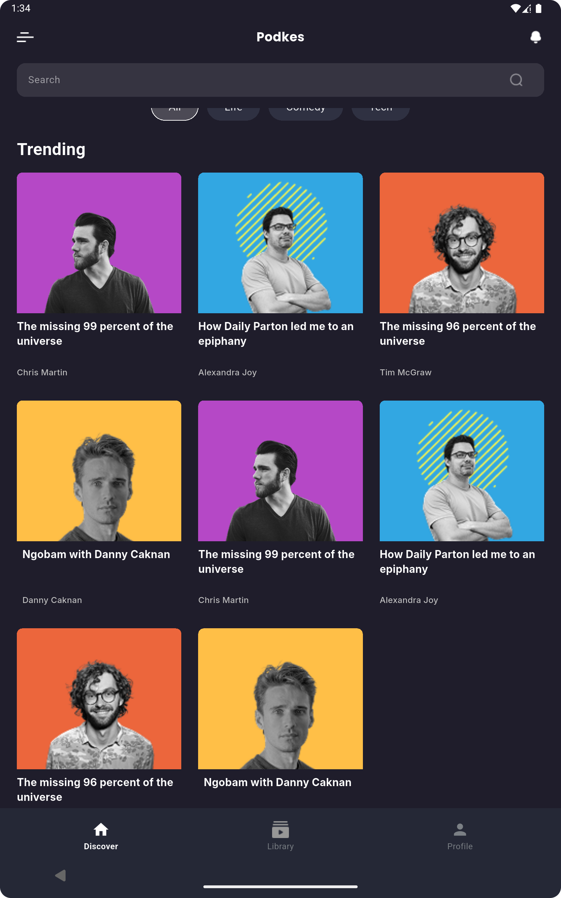
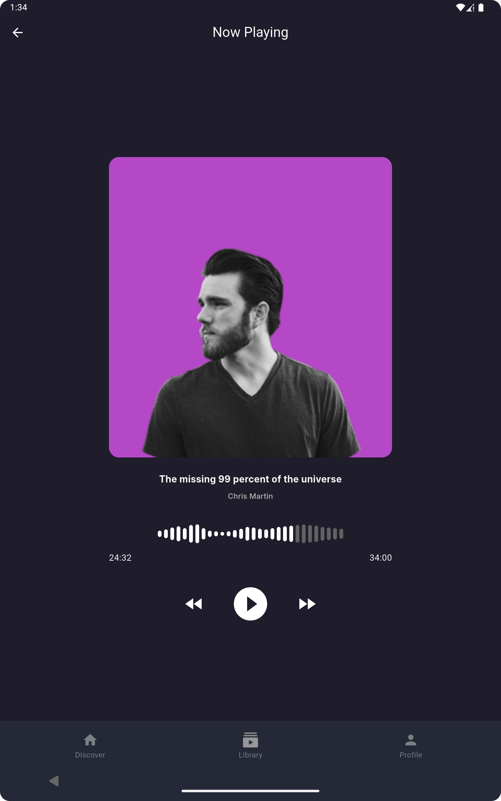
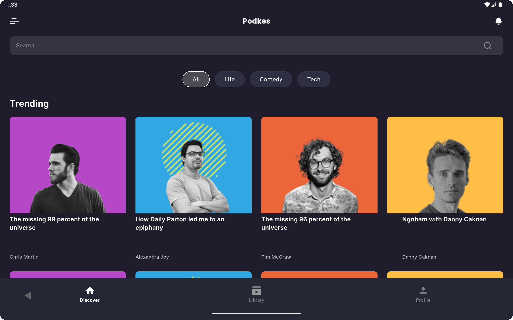
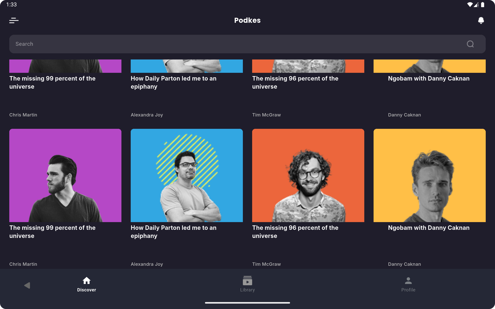
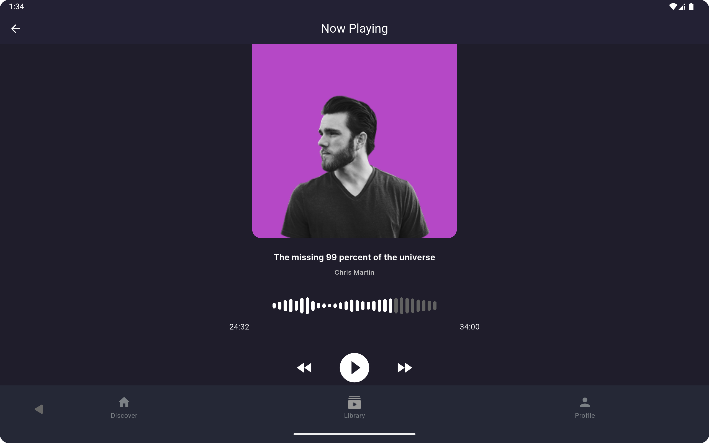

# ÇözümTR Flutter Uygulaması

**ÇözümTR**, Flutter ile geliştirilen modern bir podcast uygulamasıdır. Uygulama, Figma'dan gelen tasarımlar temel alınarak responsive şekilde hayata geçirilmiştir. BLoC yapısı ile yönetilir ve SOLID prensiplerine uygun şekilde yapılandırılmıştır.

## 🚀 Özellikler

- 🎨 3 adet birebir Figma tasarımına uygun ekran
- 📱 Telefon ve tablet desteği (dikey ve yatay yönlendirme uyumlu) ve Scroll özelliği
- 🔄 Responsive tasarım
- 🧱 BLoC mimarisi kullanımı
- 🧩 SOLID prensiplerine uygun modüler yapı

---

## 📸 Ekran Görüntüleri

### 📱 Telefon

#### Dikey Görünüm

| Onboarding | Home | Play Song |
|-----------|------|-----------|
|  |  |  |

---

### 💻 Tablet

#### Dikey Görünüm

| Onboarding | Home | Play Song |
|-----------|------|-----------|
|  |  |  |

#### Yatay Görünüm

| Home (1) | Home (2) | Play Song |
|----------|----------|------------|
|  |  |  |

